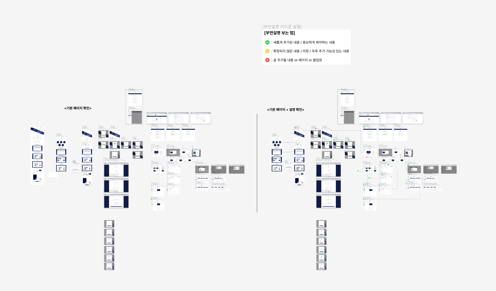

# Past-forward-pm

## 사이트 소개

### 개발 공부와 팀 프로젝트를 위한 회고 작성 웹사이트 Past Forward
팀 프로젝트 또는 개발 공부 중이신가요? 개발자가 되면 '회고'라는 단어를 많이 듣게 될 텐데, 회고는 단순한 일기가 아니라 프로젝트와 개발 과정에서 매우 중요한 부분입니다. 현업에서도 널리 사용되는 이 회고를 사용자 친화적인 웹 사이트에서 손 쉽게 시작해보세요!

- 배포 URL : https://www.pastforward.link/

 

### 사이트의 장점 및 차별성
🔹 쉬운 시작 : 회고 작성이 처음인 사람에게 매뉴얼이 될 수 있는 템플릿과 회고만을 위한 사이트이므로 초기 설정이 "회고"에 맞춰져 있습니다.

🔹 현업에서도 쓰이는 습관 : 개발자를 꿈꾸시거나 개발이 아니더라도 프로젝트를 하게 되면 회고를 하는 게 습관화 되어야 합니다. 취업 공부도 할 게 많은데 회고까지 신경써서 템플릿 만들기 어려우신 분들에게 습관화하기 좋은 사이트!

🔹 입문자를 위한 사이트 : 회고를 한번도 해보지 않은 입문자 분들도 부담 없이 사용할 수 있습니다. 복잡하지 않은 인터페이스로 쉽게 회고를 시작할 수 있습니다.

  

### 사이트의 주요 기능
📌 회고용 템플릿 제공 : 회고에서 가장 많이 사용되는 KPT가 들어있으며, 팀원들을 칭찬하고 개선할 점을 작성할 수 있는 Kudos 템플릿이 존재 
<pre>➕ How to use : 템플릿을 잘 활용할 수 있는 설명 모달창</pre>
 📌 회고 팀원과 함께 작성 : 
<pre>➕ 좋아요&댓글 : 작성된 회고 카드의 의견에 공감되면 좋아요, 추가 질문이 있다면 댓글을 달아서 소통을 기록할 수 있습니다.</pre>
 📌 쉬운 팀원 초대 : 

## 프로젝트 소개

대학생 프로젝트 팀 PastForward입니다. PastForward는 '과거를 돌아보고 미래로 나아가다'는 의미를 담아, 회고를 간편하고 효율적으로 시작할 수 있도록 개발된 웹사이트입니다.

 

## PM 업무 소개
회의록 살펴보기 -> [PM 회의록 모음](https://github.com/donga-it-club/past-forward-pm/wiki/Meeting-File)

## Version 1.0
### 1.1 전체 업무 정리

**1. 전체 프로젝트 일정 구성**  

**2. 기획 개요 제작 [**초반 기획 작업 모음**](https://www.notion.so/e7ff61f1a34f4edcba21b3d08666e43d?pvs=21)** 

**3. 웹 사이트 UX/UI 디자인 담당** - [in Figma](https://www.figma.com/file/zJaBNvTvLlG0d9h5TILICj/Past-Forward-Web-Site?type=design&node-id=524%3A9733&mode=design&t=B3sGfj94IRz1BbZV-1)

**4. 용어 정의 사전 제작 [PF 사이트 용어 정의](https://www.notion.so/PF-2a9d6f970ba544d980fce11501fba1d7?pvs=21)** 
    - 모든 팀원의 소통을 원활하게 하기 위해 비슷한 용어를 정의
      
**5. 깃허브 마일스톤 구성 및 작성**

**6. 팀원 소통 채널 생성**
    - 백 / 프론트 API 연결 시, 소통이 필요할 것으로 예상되어 생성한 채널
    - ex) [BE] → [FE] 와 같은 형식으로 글을 작성하여 질문사항을 남기도록 요청

**7. 배포글 작성 (사전 설문조사 배포 / 사후 배포 글 양식 작성)**
- 메인 키워드
  : 대학생 프로젝트 팀, 회고 플랫폼, 무료 제공, KPT/Kudos 템플릿, 모바일 지원, 성장
- 사전 설문조사 결과 (데이터팀이 분석 예정)
    - 해당 설문조사에서 배포 후 링크를 받고자 하신 분들에게 배포되었다고 메일 드릴 예정
- **사후 배포글**
    - 지정 플랫폼 : okky, 에브리타임, 링커리어, 인스타그램(각 지인들에게 비공식적으로), 카카오톡(각 지인들에게 비공식적으로)
    - 배포글 확인
          [링커리어 커뮤니티](https://community.linkareer.com/jayuu/2969023)
          [okky 커뮤니티](https://okky.kr/articles/1498997)
          [링크드인](https://www.linkedin.com/posts/%EB%AF%B8%EC%A0%95-%EA%B6%8C-08bb5b251_uqmqte-qpqrqe-uikrxgsxjtxu-activity-7192470955422580736-iWB-?utm_source=share&utm_medium=member_ios)
          [기프티콘 이벤트 링크드인](https://www.linkedin.com/posts/%EB%AF%B8%EC%A0%95-%EA%B6%8C-08bb5b251_uqmqte-qpqrqe-uikrxgsxjtxu-activity-7194226159188885504-G9Dd?utm_source=share&utm_medium=member_ios)
**7-1. 배포 방식 회고 **
      - 타겟팅을 제대로 하지 못했고 최종 배포가 아니다보니 소극적으로 배포글을 올린 경향이 있음. 데이터팀은 사용자가 많아야 하기 때문에 다음 최종 배포때는 대학교 학생들을 타겟팅하고 사이트 차별성 키워드를 변경할 예정

## Version 2.0
### 2.1 개선 사항
    
### 2.2 추가 사항

- [RetroList] 사용자가 직접 생성한 회고이거나 리더인 회고는 "본인" 이라는 표시가 회고 보드에 나타난다.
   - 내가 생성한 회고인지, 초대받아서 들어간 회고인지 한눈에 확인할 수 있다

